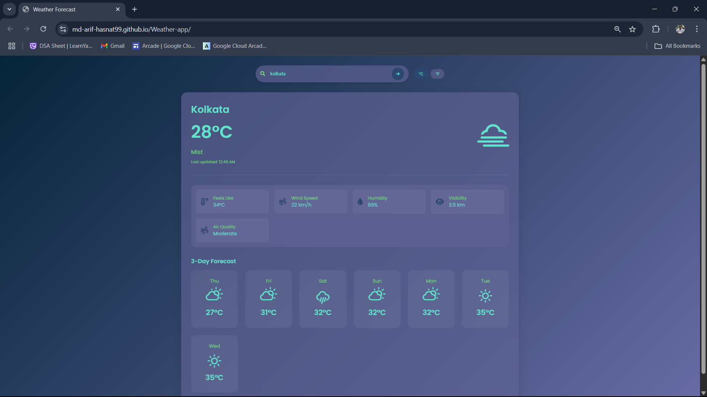

# Weather App

A simple weather application that allows users to check the current weather for any city.

## Features

- Search for weather by city name
- Display current temperature, humidity, and weather conditions
- Responsive design for mobile and desktop

## Demo

 <!-- Replace with actual screenshot if available -->

## Built With

- HTML
- CSS
- JavaScript
- [Add any frameworks or libraries used]

## Getting Started

To run this project locally:

1. Clone the repository:
    ```bash
    git clone https://github.com/Md-Arif-hasnat99/Weather-app.git
    ```
2. Navigate to the project directory:
    ```bash
    cd Weather-app
    ```
3. Open `index.html` in your browser.

## Live website link:
https://md-arif-hasnat99.github.io/Weather-app/

## API Reference

This app uses [Free Weather API](https://www.weatherapi.com/)  
<!-- Replace or update if you use a different API -->

## Contributing

Contributions are welcome! Please open an issue or submit a pull request for improvements or bug fixes.

